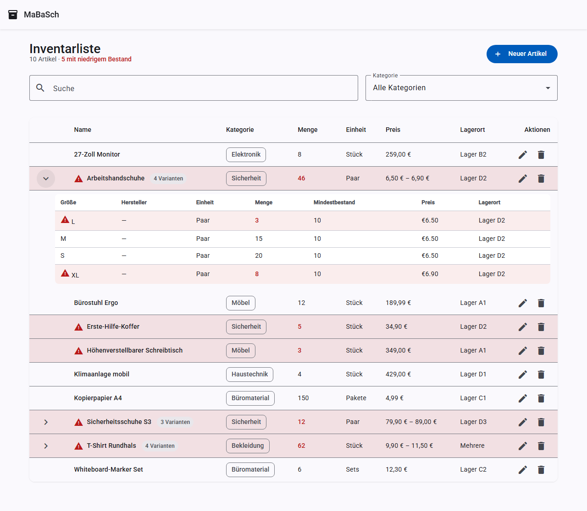
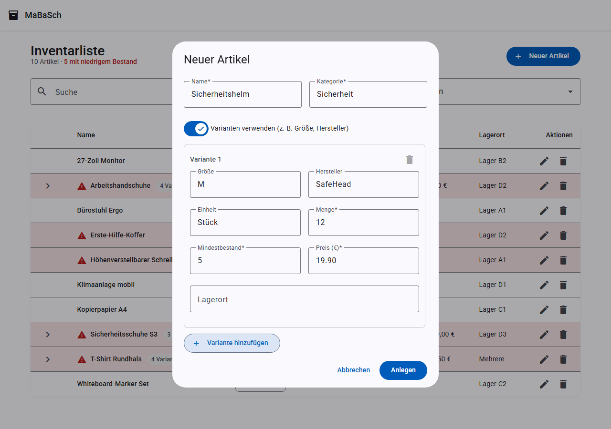

# Funktionen

## Inventarliste

Die Startseite zeigt alle Artikel in einer sortierbaren Tabelle mit Name, Kategorie, Menge,
Einheit, Preis und Lagerort. Artikel, deren Menge den Mindestbestand unterschreitet, werden
rot hervorgehoben und mit einem Warnsymbol markiert.

## Suche

Über das Suchfeld lässt sich nach Name, Kategorie oder Lagerort filtern — bei Artikeln mit
Varianten auch nach Größe, Hersteller oder Lagerort der einzelnen Variante. Die Suche
reagiert mit einer kurzen Verzögerung (Debounce), sodass nicht bei jedem Tastendruck ein
Request ausgelöst wird.

## Kategorie-Filter

Zusätzlich zur Suche kann die Liste auf eine bestimmte Kategorie eingeschränkt werden.

## Sortierung

Ein Klick auf die Spaltenköpfe **Name**, **Kategorie**, **Menge** oder **Preis** sortiert die
Liste auf- bzw. absteigend nach dieser Spalte.

## Artikel anlegen

Über den Button **Neuer Artikel** öffnet sich ein Dialog mit allen Pflichtfeldern
(Name, Kategorie, Menge, Mindestbestand, Einheit, Preis) sowie dem optionalen Lagerort.

## Artikel bearbeiten

Über das Stift-Symbol in der jeweiligen Zeile lässt sich ein bestehender Artikel bearbeiten.
Der Dialog ist mit den aktuellen Werten vorausgefüllt.

## Artikel löschen

Das Papierkorb-Symbol öffnet einen Bestätigungsdialog, bevor ein Artikel endgültig gelöscht
wird.

## Artikel-Varianten (Größe, Hersteller)

Artikel, die es in mehreren Größen oder von mehreren Herstellern gibt (z. B. Arbeitshandschuhe
in S/M/L/XL oder ein T-Shirt von zwei Herstellern), lassen sich als **ein Artikel mit mehreren
Varianten** anlegen. Jede Variante hat eine eigene Menge, einen eigenen Mindestbestand, Preis,
Lagerort und optional eine eigene Einheit.

In der Liste erscheint ein Varianten-Artikel als eine Zeile mit aggregierten Werten
(Gesamtmenge, Preisspanne). Ein Klick auf den Pfeil links klappt die Detailaufteilung nach
Größe/Hersteller auf.

Beim Anlegen oder Bearbeiten eines Artikels aktiviert der Schalter **„Varianten verwenden"**
den Varianten-Modus: Statt der direkten Bestandsfelder erscheint eine Liste von
Varianten-Zeilen (Größe, Hersteller und Einheit optional, Menge/Mindestbestand/Preis
Pflichtfelder), die sich per **„Variante hinzufügen"** erweitern lässt.

Ein Artikel kann jederzeit zwischen „einfach" (direkte Felder) und „mit Varianten"
umgeschaltet werden — die Bestandswarnung wird dann pro Variante geprüft und der Artikel
als Ganzes gilt als „niedriger Bestand", sobald mindestens eine Variante betroffen ist.

## Bestandswarnung

Sobald die Menge eines Artikels (bzw. einer Variante) seinen Mindestbestand erreicht oder
unterschreitet, wird die Zeile rot eingefärbt und mit einem Warnsymbol versehen — sowohl in
der Liste als auch beim Bearbeiten sichtbar.

## Responsives Design

Die Anwendung ist für mobile Geräte optimiert: Auf schmalen Bildschirmen lässt sich die
Tabelle horizontal scrollen, alle Dialoge und Formulare passen sich der Bildschirmbreite an.

