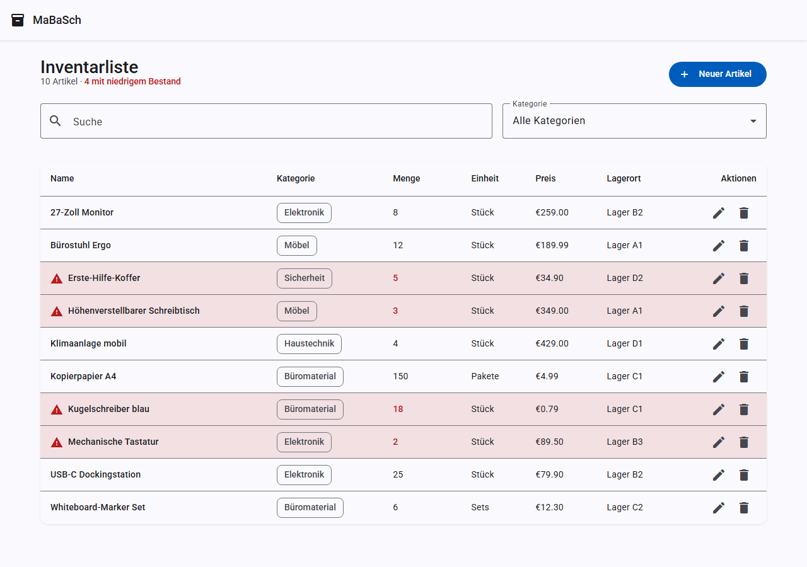
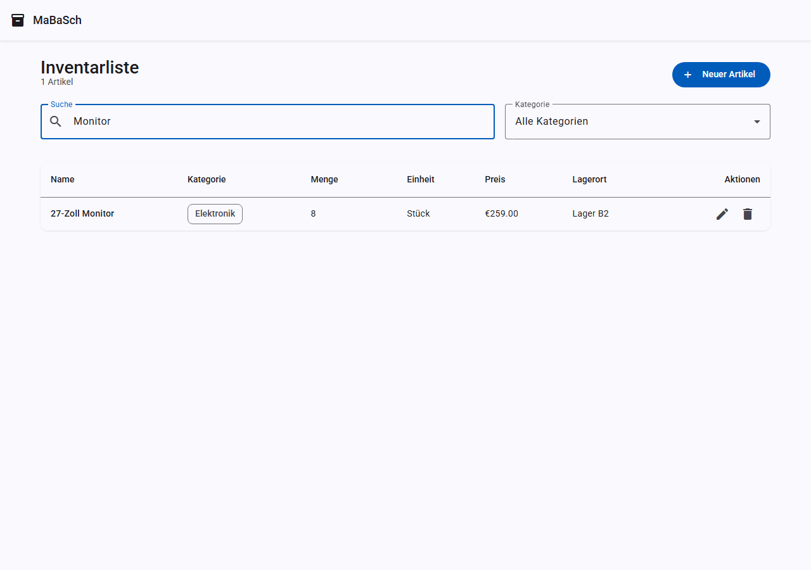
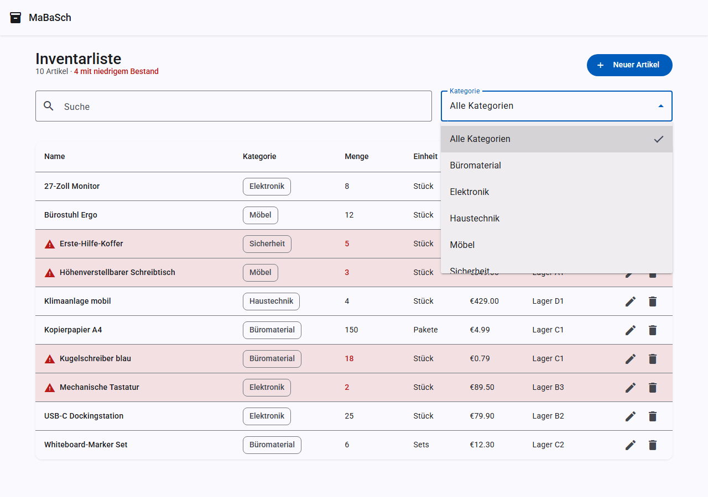
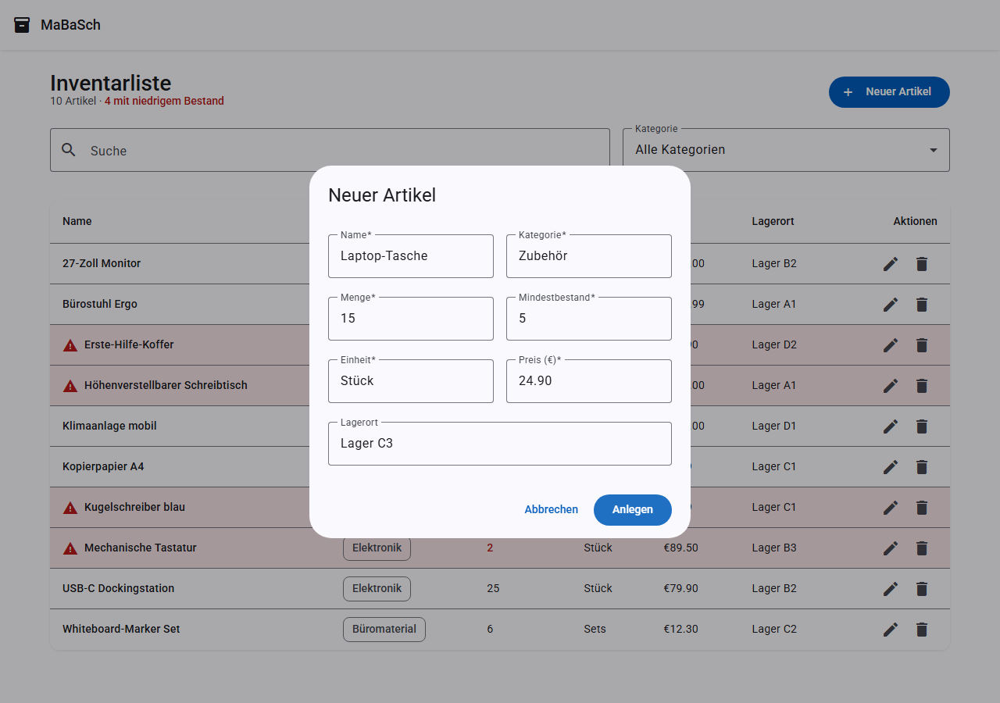
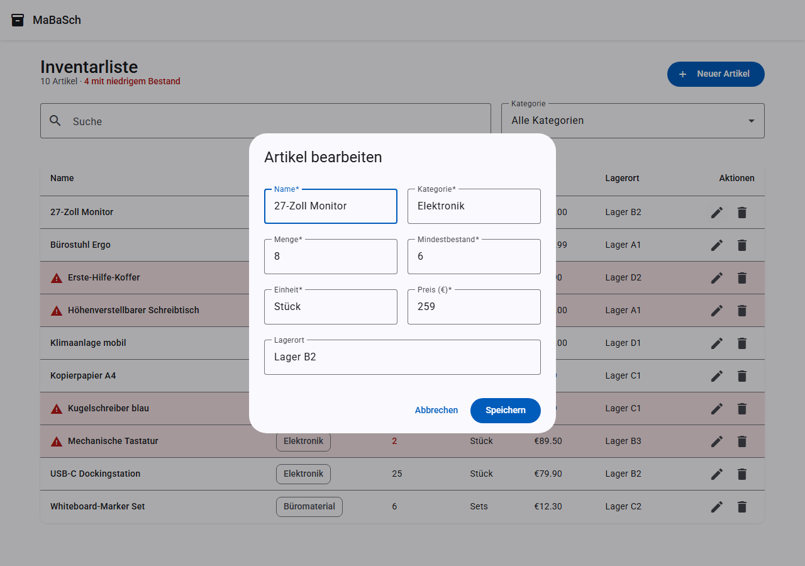
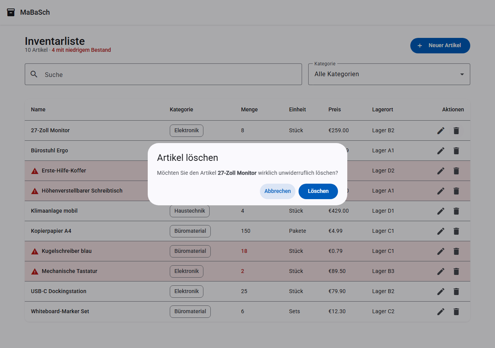
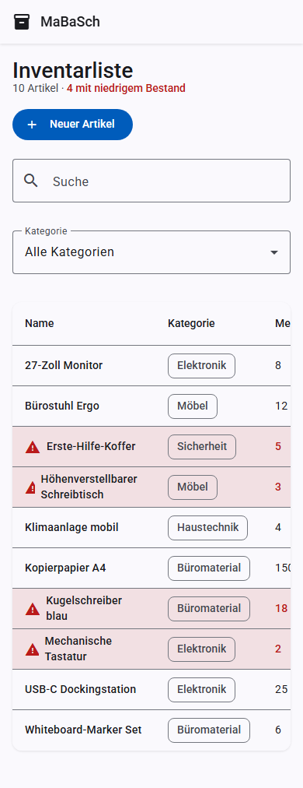

# Funktionen

## Inventarliste

Die Startseite zeigt alle Artikel in einer sortierbaren Tabelle mit Name, Kategorie, Menge,
Einheit, Preis und Lagerort. Artikel, deren Menge den Mindestbestand unterschreitet, werden
rot hervorgehoben und mit einem Warnsymbol markiert.

## Suche

Über das Suchfeld lässt sich nach Name, Kategorie oder Lagerort filtern. Die Suche reagiert
mit einer kurzen Verzögerung (Debounce), sodass nicht bei jedem Tastendruck ein Request
ausgelöst wird.

## Kategorie-Filter

Zusätzlich zur Suche kann die Liste auf eine bestimmte Kategorie eingeschränkt werden.

## Sortierung

Ein Klick auf die Spaltenköpfe **Name**, **Kategorie**, **Menge** oder **Preis** sortiert die
Liste auf- bzw. absteigend nach dieser Spalte.

## Artikel anlegen

Über den Button **Neuer Artikel** öffnet sich ein Dialog mit allen Pflichtfeldern
(Name, Kategorie, Menge, Mindestbestand, Einheit, Preis) sowie dem optionalen Lagerort.

## Artikel bearbeiten

Über das Stift-Symbol in der jeweiligen Zeile lässt sich ein bestehender Artikel bearbeiten.
Der Dialog ist mit den aktuellen Werten vorausgefüllt.

## Artikel löschen

Das Papierkorb-Symbol öffnet einen Bestätigungsdialog, bevor ein Artikel endgültig gelöscht
wird.

## Bestandswarnung

Sobald die Menge eines Artikels seinen Mindestbestand erreicht oder unterschreitet, wird die
Zeile rot eingefärbt und mit einem Warnsymbol versehen — sowohl in der Liste als auch beim
Bearbeiten sichtbar.

## Responsives Design

Die Anwendung ist für mobile Geräte optimiert: Auf schmalen Bildschirmen lässt sich die
Tabelle horizontal scrollen, alle Dialoge und Formulare passen sich der Bildschirmbreite an.

